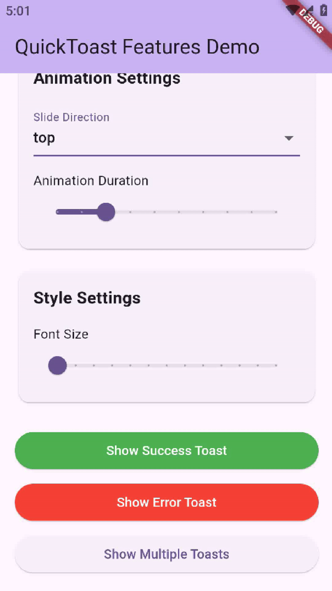

# QuickToast 🍞

A lightweight, flexible toast notification library for Flutter that automatically handles varying content sizes and provides smooth animations. QuickToast makes it simple to display beautiful, stacked notifications in your Flutter apps with minimal setup.

## ✨ Features

- 🎯 **Smart Positioning**: Automatically handles varying toast heights and stacks them properly
- 🎨 **Variants with Icons**: 
  - 🟢 Success toasts with check icon
  - 🔴 Error toasts with cancel icon
  - 🔵 Info toasts with info icon
- 📐 **Flexible Placement**:
  - Vertical: Top or bottom
  - Horizontal: Left, center, or right
- ⚡ **Smooth Animations**: 
  - Fade in/out
  - Customizable slide directions
- 🎛️ **Rich Customization**:
  - Duration control
  - Custom text styles
  - Icon colors
  - Spacing and margins
  - Shadow and border radius
- 📦 **Simple Integration**: Just wrap your app and start showing toasts

## 📦 Installation

Add QuickToast to your `pubspec.yaml`:
```yaml
dependencies:
  quick_toast: ^1.0.0
```

## 🚀 Usage

### 1. Wrap Your App

First, wrap your app with `ToastOverlayWrapper`:

```dart
void main() {
  runApp(
    ToastOverlayWrapper(
      child: MaterialApp(
        home: MyHomePage(),
      ),
    ),
  );
}
```

### 2. Show Toasts

Use the `QuickToast.instance` to display toasts:

```dart
// Success toast
QuickToast.instance.show(
  message: 'Operation completed successfully!',
  variant: ToastVariant.success,
);

// Error toast
QuickToast.instance.show(
  message: 'Something went wrong',
  variant: ToastVariant.error,
);

// Info toast
QuickToast.instance.show(
  message: 'New message received',
  variant: ToastVariant.info,
);
```

### 3. Customize Appearance

Configure global toast settings:

```dart
QuickToast.instance.setConfig(
  QuickToastConfig(
    verticalPosition: ToastVerticalPosition.bottom,
    horizontalPosition: ToastHorizontalPosition.center,
    displayDuration: const Duration(seconds: 3),
    animationDuration: const Duration(milliseconds: 300),
    toastSpacing: 8.0,
    textStyle: const TextStyle(fontSize: 16),
    iconColor: Colors.white,
    // ... other customization options
  ),
);
```

## 🎯 Complete Example

```dart
import 'package:flutter/material.dart';
import 'package:quick_toast/quick_toast.dart';

void main() {
  runApp(const MyApp());
}

class MyApp extends StatelessWidget {
  const MyApp({super.key});

  @override
  Widget build(BuildContext context) {
    return ToastOverlayWrapper(
      child: MaterialApp(
        home: Scaffold(
          appBar: AppBar(title: const Text('QuickToast Demo')),
          body: Center(
            child: Column(
              mainAxisAlignment: MainAxisAlignment.center,
              children: [
                ElevatedButton(
                  onPressed: () => QuickToast.instance.show(
                    message: 'Success!',
                    variant: ToastVariant.success,
                  ),
                  child: const Text('Show Success Toast'),
                ),
                ElevatedButton(
                  onPressed: () => QuickToast.instance.show(
                    message: 'Error occurred!',
                    variant: ToastVariant.error,
                  ),
                  child: const Text('Show Error Toast'),
                ),
                ElevatedButton(
                  onPressed: () => QuickToast.instance.show(
                    message: 'Just FYI!',
                    variant: ToastVariant.info,
                  ),
                  child: const Text('Show Info Toast'),
                ),
              ],
            ),
          ),
        ),
      ),
    );
  }
}
```

## 🔧 Configuration Options

The `QuickToastConfig` class provides these customization options:

- `textStyle`: Custom text style for toast messages
- `verticalPosition`: Top or bottom placement
- `horizontalPosition`: Left, center, or right alignment
- `slideDirection`: Animation slide direction
- `displayDuration`: How long toasts remain visible
- `animationDuration`: Length of show/hide animations
- `toastSpacing`: Space between stacked toasts
- `margin`: Edge margins for toast positioning
- `boxShadow`: Customizable shadow effect
- `borderRadius`: Corner rounding
- `contentPadding`: Inner padding
- `iconColor`: Color for variant icons

## 🧾 License  

This project is licensed under the [Apache License](https://github.com/zohaibanwer984/quick_toast/blob/main/LICENSE).

---

## 🤝 Contributing  

Found a bug or have an idea for a new feature? Feel free to [open an issue](https://github.com/zohaibanwer984/quick_toast/issues) or submit a pull request.  
